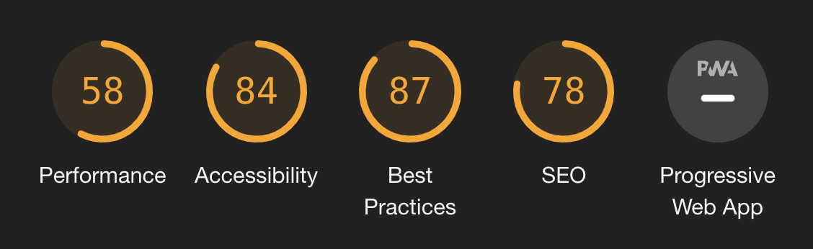

# La chouette agence - Juin 2021

Optimisation d'un site existant avec deux objectifs principaux :

- améliorer le **SEO**
- améliorer l'**accessibilité web**

## Page de démonstration

Le rendu de ce code est accessible sur cette [GitHub Page dédiée](https://logic-fabric.github.io/la-chouette-agence/).

## Audit _Google Lighthouse_ initial

## Design initial des deux pages du site

### Page d'accueil initiale

### Page de contact initiale

